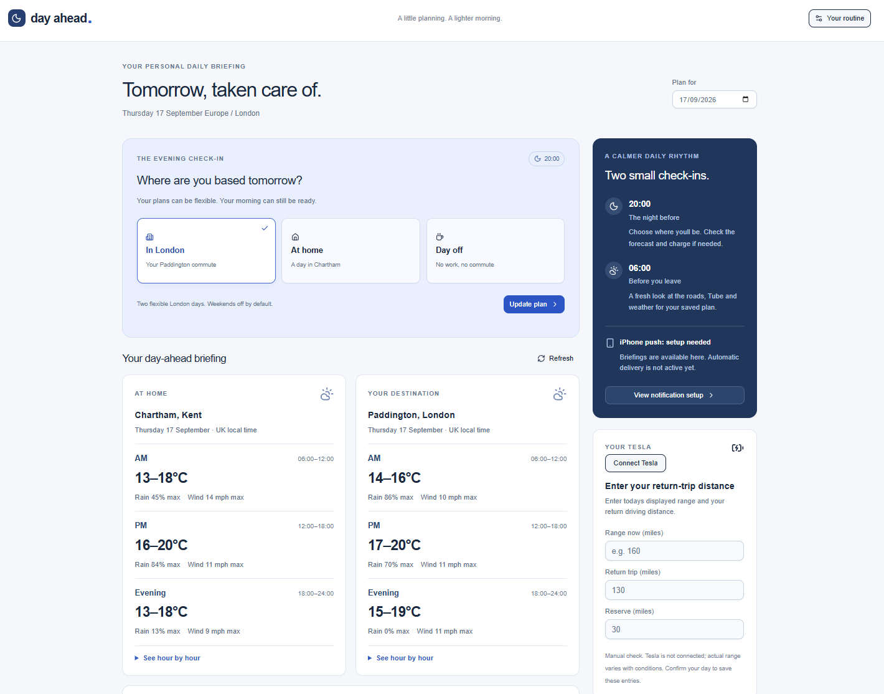
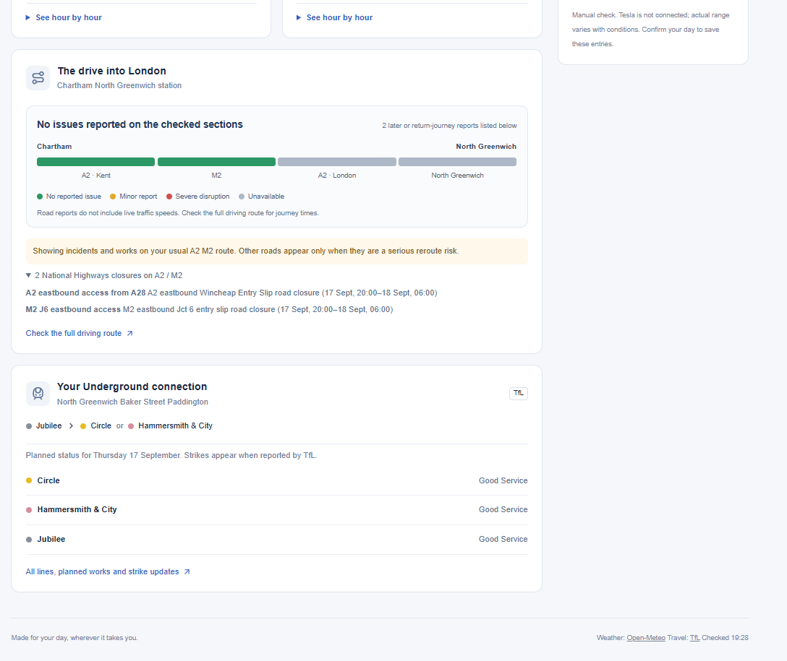

# Day Ahead

A personalised evening briefing that helps me prepare for the next day.

Day Ahead combines my plans for tomorrow with weather, EV range,
road disruption and public transport status to answer a simple question:

**Am I ready for tomorrow?**

## Why I built it

Twice a week I commute into London, and every evening I found myself checking
several different things to work out what tomorrow looked like:

- What's the weather going to be?
- Is my Tesla charged enough for the journey?
- Are there problems on my driving route?
- Are there rail or London Underground disruptions?
- Do I need to do anything tonight to be ready?

Day Ahead brings that information together into a single personalised briefing.

Rather than repeatedly checking several apps, I tell Day Ahead where I'm going
tomorrow and it works out what I need to know.

## What it does

Day Ahead currently brings together:

- 🌦️ Weather forecasts
- 🚗 Journey and commute information
- 🔋 Live Tesla state of charge and range
- ⚡ Charging recommendations based on the planned journey
- 🚦 Road disruption information
- 🚇 Live TfL service status
- 🚆 Travel disruption information
- 📱 Evening and morning push notifications
- 📲 Installable iPhone web app

The app asks where I'm going the following day and uses that context to create
a useful briefing rather than simply displaying raw information.

## The idea

The project started with a simple question:

> Why am I opening several different apps every evening just to understand
> whether I'm ready for tomorrow?

Day Ahead is an experiment in turning that repeated behaviour into a small
personal product.

## How it works

At a high level:

User's plan for tomorrow
        ↓
Day Ahead
        ↓
┌─────────────────────────────┐
│ Weather                     │
│ Tesla vehicle data          │
│ Journey requirements        │
│ Road disruption             │
│ TfL / transport status      │
└─────────────────────────────┘
        ↓
Personalised briefing
        ↓
Evening / morning notification

## Technology

Day Ahead is a full-stack TypeScript application built with AI-assisted
development using OpenAI Codex.

The project uses technologies including:

- TypeScript
- React
- Vinext / Vite
- Cloudflare Workers
- Cloudflare D1
- Tesla Fleet API
- TfL and transport data
- Web Push / service workers

## Building with AI

One of the reasons I built Day Ahead was to explore how someone with a product
background can use modern AI coding tools to go from an idea to a working
software product.

I used Codex throughout development, but remained responsible for defining the
problem, product behaviour, integrations, testing and iteration.

The Git history shows the product evolving incrementally through features,
experiments and fixes rather than being generated as a single finished project.

## What I learned

Building Day Ahead has given me hands-on experience with areas including:

- Working with external APIs
- OAuth and authentication flows
- Environment variables and secrets
- Push notifications
- Service workers
- Cloud deployment
- Git and GitHub
- Debugging integrations
- Developing software with an AI coding agent

It has also reinforced something from a product perspective: useful software
doesn't necessarily need to start with a large market opportunity. Day Ahead
started by solving a recurring problem I personally experienced.

## Status

Day Ahead is an active personal project and proof of concept.

It works for my own commute and circumstances, but it isn't intended to be a
production-ready consumer application.

I'm continuing to improve the integrations, reliability and user experience.

## Next

Areas I'm interested in exploring include:

- Improving briefing personalisation
- More robust travel disruption handling
- Better notification logic
- Additional journey contexts beyond commuting
- Exploring how AI can decide which information is actually relevant to surface 
